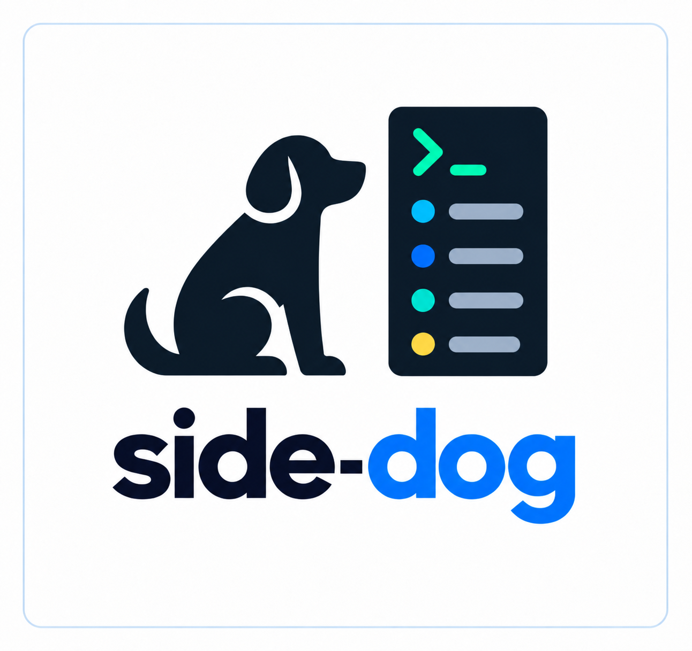
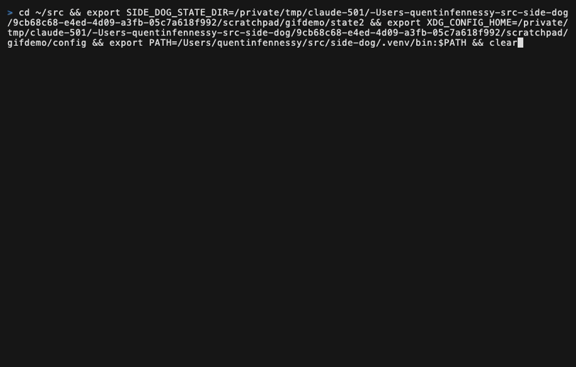

# Side Dog

<p align="center">
  
</p>

*Created 2026-08-31 · Updated 2026-09-01*

Side Dog was inspired by [Sundai Hack 138](https://sundai.club). Sundai Club is a
community for building and launching AI prototypes every Sunday.

Side Dog is a narrow terminal timeline and local browser panel for watching
coding agents work. Codex reports itself: Side Dog reads a privacy-filtered
view of Codex's local activity stream. Claude reports itself once you run
`side-dog setup`, which can install hooks for that project; without them Claude's
work still shows up, as file changes with no agent attached. Agents are found
these ways - Herdr, which knows terminal panes; Claude's own registry of live
sessions at `~/.claude/sessions`; and Codex's and Pi's session files - so an agent
running in a desktop app or an editor is named with its model, its reasoning
effort and whether it is working, the same as one in a terminal. Herdr wins
where two sources describe one session, because it alone knows the pane and the
terminal title. The timeline shows:

- file and configuration writes, with lines added and removed against the
  last commit;
- running, passed, and failed test commands;
- branch, worktree, commit, and push operations;
- pull request creation, checks starting, passing and failing, and merges;
- issue creation, closure, and reopening;
- commands that failed, named by program only; and
- agent session and turn boundaries.

It is deliberately small: Python 3.11+, one lightweight terminal-width
dependency, an append-only JSONL activity feed, and an ANSI terminal UI that
uses the full pane width by default while remaining readable in a narrow split.
Use `--width 42` when an explicit cap is useful.



## Support status

- **Codex:** ready for local use and the installation path documented below.
  Terminal and Codex Desktop sessions are both named, with their model, effort
  and status.
- **Claude Code — naming sessions:** ready, and it needs no setup. Side Dog
  reads Claude's own registry of live sessions, so a session in a terminal, in
  the desktop app or in an editor is named with its model, reasoning effort and
  whether it is working.
- **Claude Code — collecting activity:** ready, once you run `side-dog setup`.
  Hooks report what Claude does as it does it: tool calls starting, writes
  confirmed, writes that failed, session and turn boundaries. Without them
  Claude's work still appears, but only as file changes with no agent attached,
  because Claude has no local activity stream for Side Dog to read the way
  Codex does. The hooks are installed per project into
  `.claude/settings.local.json`, never into the shareable `.claude/settings.json`,
  and the desktop app honours them the same as the terminal.
- **Pi — naming sessions:** ready, and it needs no setup. Pi writes one session
  file per run under `~/.pi/agent/sessions` (honouring `PI_HOME`), so a Pi
  session in a terminal, an editor or a desktop surface is named with its model,
  reasoning effort and whether it is working, exactly as a Codex session is.
  Herdr still wins where it knows the pane. Activity collection beyond naming is
  not yet wired up.

Side Dog is an activity visualization, not an audit or security boundary. It
stores short event metadata but never stores prompts, responses, file contents,
diffs, full shell commands, stdout, or stderr.

## First-run tour

Try the complete browser experience without a repository or active agent:

```sh
side-dog demo --panel
```

Use `side-dog demo --watch` for the terminal version. Both tours create two
temporary folders, stream clearly labeled synthetic success, failure, running,
file, Git, and GitHub activity, explain the `h` timeline/highway switch, and
remove all temporary activity when the tour exits.

## Install

Prerequisites:

- Python 3.11 or newer;
- [uv](https://docs.astral.sh/uv/getting-started/installation/);
- Herdr, if you want pane, tab and terminal-title detail. Codex Desktop, the
  Claude desktop app, editors and a plain terminal are all found without it;
- Git, plus an authenticated `gh` CLI if pull-request readback is wanted.

Clone and verify Side Dog from its checkout:

```sh
git clone https://github.com/qfennessy/side-dog.git
cd side-dog
uv sync
uv run side-dog help
```

To make `side-dog` available outside this checkout:

```sh
uv tool install .
side-dog help
```

After pulling a newer checkout, update that installation with
`uv tool install --force .`. Remove it with `uv tool uninstall side-dog`.

Check local readiness without changing anything:

```sh
side-dog doctor .
```

The doctor distinguishes required Git/project failures from optional GitHub,
Claude, and Herdr capabilities, explains what an unavailable integration
removes, and prints the recommended terminal and browser launch commands. Add
`--no-color` for plain text suitable for logs.

For a guided first run, choose agent-specific and optional integrations with:

```sh
side-dog setup .
```

Setup explains that Codex needs no hooks, offers project-local Claude Code
hooks when Claude is detected, explains the optional Herdr context, previews
`.claude/settings.local.json` before changing it, and prints exact `watch`,
`panel`, and `doctor` commands. Scripts can make every choice deterministic
with `--claude` or `--no-claude` and `--herdr` or `--no-herdr`. The older
`side-dog init` command remains a direct alias for Claude hook installation.

## First run with Codex

The startup header always names the folder-discovery mode. A bare
`side-dog watch` automatically discovers current agent folders (or inherits the
current Herdr session), while `side-dog watch .` explicitly selects the current
folder. Passing folders with `--herdr` keeps those folders and adds live Herdr
folders; passing only `--herdr` requires Herdr discovery.

Codex requires no Side Dog hook installation. Start Codex in Herdr, then run
Side Dog from any shell pane in that Herdr session:

```sh
side-dog watch
```

With no folder arguments, Side Dog detects the inherited Herdr environment and
automatically follows the coding-agent folders in that session, including agents
that start later. It uses one shared Herdr snapshot and keeps at most eight of
the busiest folders visible. To use Chrome instead, run:

```sh
side-dog panel
```

An explicit folder keeps the original narrow behavior, even inside Herdr:

```sh
side-dog watch /absolute/path/to/project
```

Add `--herdr` when explicit folders should stay pinned while other live Herdr
folders join automatically. Outside Herdr, zero-argument `watch` and `panel`
continue to watch the current folder.

Within every watched folder, Side Dog also finds Codex sessions with no pane at
all, including Codex Desktop, by reading Codex's own session files. Any recent
session working in the same repository is named, with its model, effort, and
whether it is working or idle.

When working directly from the checkout without `uv tool install`, prefix those
commands with `uv run`, for example `uv run side-dog watch .`.

On a successful first run, the header names the watched folder and shows the
matched Codex session, model, effort, and activity state. If it keeps saying it
is waiting for an agent, confirm that the explicit path resolves to the same
repository or worktree as the Codex session. A session with no pane is only
looked for while it is recent: fifteen minutes after its last write, Side Dog
treats it as finished rather than idle.

Press `?` in the Side Dog pane for a quick guide. Press `e` to switch between
compact and expanded detail, `f` to cycle all/milestone/file views, and `p` to
pause or resume display updates without stopping collection. Press `r` to
toggle between the default newest-first timeline and an oldest-first feed with
new activity at the bottom. Press `?` again or `Esc` to return to the timeline.
After any display-changing key, Side Dog briefly shows a non-modal explanation
of the resulting view above the timeline. The notice disappears after two
seconds; another key immediately replaces it and restarts the timer. Collection
and polling continue while the notice is visible, including when the displayed
timeline is paused.

With no folder at all, Side Dog watches wherever agents are working:

```sh
side-dog watch
```

It asks all three identity sources - Herdr's panes, Claude's registry of live
sessions, and Codex's session files - where every agent on the machine is
working right now, turns each answer into the worktree that folder belongs to,
drops anything the configuration file ignores, and adds anything it pins.
Folders with an agent working this minute are kept first, so when there are
more than fit the quiet ones are the ones left out. If no agent is running
anywhere, it watches the current folder, so the bare command is never useless.
Naming a folder still means exactly that folder, and `.` still means the one
you are in.

Watch a whole space by name:

```sh
side-dog watch @cocos-story
```

Herdr already labels each of its workspaces after the repository open in it, so
`@name` is matched against those labels, ignoring case, and Side Dog watches
the folders the agents in that workspace are working in. Save your own set of
folders under a name with `--save`:

```sh
side-dog watch ~/src/project ~/src/project-issue-42 --save review
side-dog watch @review
```

A name you saved wins over a Herdr label spelled the same way, so saving
something always takes effect. If a name matches nothing, or matches two Herdr
workspaces at once, Side Dog stops and lists the names that do exist rather
than guessing.

Watch several folders in one pane by passing each one:

```sh
side-dog watch \
  ~/src/project \
  ~/src/project-issue-42 \
  ~/src/another-project
```

A folder that has been deleted can still be watched: its recorded
activity stays in Side Dog's own state directory, the header marks it as
`folder is gone`, and if the folder comes back Side Dog adopts what is in it
instead of reporting every file as new. A path with no folder and no recorded
activity is still refused, so a typo is still an error.

Side Dog tracks each folder separately: its own file snapshot, read position,
Git state, agents, and GitHub status. It merges only copied
display records, leaving every project's append-only JSONL feed unchanged.
Events are labeled with the folder's PR number, branch, or name. In a
color terminal that label is printed when the folder changes and every line
starts with a solid block in that folder's color, so a run of activity from one
folder does not repeat its own name. The block reuses the two cells the line
already spent on its border, so it costs no width. One color per folder is used
in three places - the block, the folder's badge, and its name in the header - so
the header reads as the legend for the blocks. Folders with activity on screen
are named first, so every visible color has a name. Without color the label stays on every line.
The header names the folders that fit, preferring folders with a working agent
over finished pull requests, and counts the rest as `+N quiet`. Press
`a` to show all folders, `Tab` to move to the next one, or `1` through `9` to
jump to a folder by position. Existing `r`, `e`, `f`, and `p` controls apply to the
consolidated timeline. In a color terminal, the header shows folders with a
working agent in bold, dims folders whose agents are all idle or done, and
leaves folders with unknown activity neutral. Timeline event styling is unchanged.

Side Dog also watches the worktrees of the folders you name, but only the ones
something is happening in, and drops them again once they are done: a worktree
whose pull request has merged or closed leaves the pane unless an agent is still
sitting in it. A folder you named on the command line is never dropped.
The browser panel applies the same rule. A worktree qualifies if a coding agent is sitting in
it right now, if Side Dog has recorded activity there in the last day, or if its
branch got a commit in the last day. Quiet worktrees stay out, so a repository
full of finished branches does not eat the pane; each one joins on its own as
soon as it wakes up, and a short notice names it. A worktree created while Side
Dog is running joins straight away, because an agent branching into one is
about to work there.

Side Dog watches at most eight folders at once, and the busiest worktrees win
when there is no room. Pass `--no-follow-worktrees` to watch only the folders
you named.

In a wide terminal, the default `auto` layout gives every folder its own column
when each column can remain at least 42 characters wide. Each column has its
own folder, GitHub, agent, date, and timeline context; events never cross between
columns. Resize narrower to return automatically to the consolidated timeline,
or select a layout explicitly:

```sh
side-dog watch . ../worktree-a --layout columns
side-dog watch . ../worktree-a --layout timeline
```

Focusing a folder with `Tab` or `1` through `9` uses the full pane for that folder;
press `a` to restore all folder columns. The temporary view notice says which folder
is focused or whether all folders are shown as columns or one consolidated
timeline.

## First run with Claude Code

Run guided setup and choose Claude hooks, then restart Claude Code so it loads
them:

```sh
cd ~/src/project
side-dog setup . --claude
```

Then watch it in a narrow pane:

```sh
side-dog watch .
```

Claude's tool calls now arrive as they happen: an edit starting, a write
confirmed, a write that failed, a command that failed, and session and turn
boundaries that group a turn's work into one card. Without the hooks Claude's
work still shows up, but as plain file changes with no agent attached.

Setup writes only to `.claude/settings.local.json`, which is machine-local and
normally gitignored, and leaves any hooks you already have in place. It is safe
to run again. The Claude desktop app and the editor extensions honour the same
file, so one install covers every surface. `side-dog init .` remains available
as the direct backwards-compatible hook installer.

## Local web panel

Use the same activity model in a narrow browser window with `panel`. Press `C`
in a running terminal pane to open it for the folders already being watched, or
start it yourself:

```sh
side-dog panel .
side-dog panel ~/src/project ~/src/another-project
```

Side Dog binds only to `127.0.0.1` on a free port, adds a random unguessable
path to the URL, rejects non-local Host headers, and disables browser caching.
It serves event metadata only—never file contents or command bodies. Chrome and
Chromium open in a 360×1040 app window when available; otherwise Side Dog uses
the default browser. Pass `--no-open` to print the local URL without launching
a window, or `--port PORT` to select a specific local port.

The panel says `Watching:` before every repository name so the displayed Git
branch and commit cannot be mistaken for the running Side Dog version. Its
auto layout places watched folders side by side when each has at least 300 pixels,
then falls back to a stack as the window narrows. Select `columns` or `stack`
to request that layout; picking `columns` always gives columns, and the row
scrolls sideways when the pane is too narrow. The `e`, `f`, `p`, `r`, `a`,
`Tab`, and `1`–`9` controls match the
terminal feed: expand details, filter, pause, reverse order, and focus one folder.
Buttons and keyboard controls show the same two-second view explanation as the
terminal, and rapid changes replace the prior message instead of queuing it.
PR, issue, and commit events link to GitHub when an origin URL is available.

Press `h` (or click `highway`) for the live pulse view. Each folder keeps its own
four lanes—files, tests, Git, and GitHub—with the NOW line at the top. Completed
events age downward at a constant rate; `s` cycles `0.5×`, `1×`, and `2×` speed.
Running operations stay on NOW with a hold tail proportional to elapsed time,
then resolve to `PASS`, `MISS`, or neutral when their matching completion
arrives. Success increases the combo, failure resets it, and unknown status is
neutral: it neither increments nor resets the combo. `p` and the operating
system's reduced-motion preference show the identical static pulse strip and
schedule no animation frames. Press `h` again to return to the default row
timeline.

Each watched folder gets one color, fixed by its position on the command line.
In the terminal that color appears in three places: the solid block at the start
of every one of its lines, its `[folder]` badge, and its name in the header. The
badge is printed when the folder changes rather than on every line, so a run of
activity from one folder does not repeat its own name; the block carries the
folder the rest of the way. Because the header uses the same colors, it reads as
the legend for the blocks, and folders with activity on screen are named there
first. PR and CI text colors are a separate system: blue means open, yellow
means pending, green means clean or merged, and red means failed. Text labels
are always kept. The 12-color palette repeats predictably for larger folder
sets; `--no-color` and redirected output drop every ANSI accent, and there the
badge stays on every line because there is no color to read instead.

The header line carries a clock, so a quiet pane is visibly still running, and
each folder's name is followed by a one-character meter that grows with what has
been happening there in the last ten minutes: blank when quiet, a thin line at
the bottom for a little, a full block for the busiest. Every meter on the line
is measured against the same busiest folder, so they can be compared with each
other rather than only with themselves.

The header also counts the worker subagents a Codex session is running. Herdr
reports the session, not the workers it spawns, so a pane can otherwise say
`1 agent` while four named workers write in four different worktrees.

The `e`, `f`, and `r` toggles are remembered between runs in
`~/.local/state/side-dog/display.json`, so Side Dog reopens the way you left it.
The configuration file described under [Configuration](#configuration) sets
where those toggles start; the keys still write to `display.json`, so the last
key you pressed wins over the file.

All agent, filesystem, Git, test, and GitHub events appear in one newest-first
timeline. The display fills the available pane height with retained semantic
events and reports how many continue below the viewport. Codex-originated
events carry a compact `Codex` label and Claude's carry a `Claude` label.
Reversing the display changes complete semantic-unit order only: compact groups,
expanded detail, filters, and paused snapshots retain their normal behavior and
the append-only JSONL order and contents are unchanged.
Filter the timeline by Herdr pane ID, task title, or agent session-ID prefix:

```sh
side-dog watch . --session wB:p1
```

To see the display before starting an agent, run the self-contained terminal
tour:

```sh
side-dog demo --watch
```

## How Side Dog chooses folders

`side-dog watch` decides what to watch in this order:

1. **Folders you name win.** `side-dog watch ~/src/app ~/src/app-issue-42`
   watches exactly those, and `@name` expands a saved space or a Herdr
   workspace label first. Named folders are never ignored and never retired.
2. **No folders, inside a Herdr session:** it follows that session - the
   folders your session's agents are working in - because the session you are
   sitting in is a more specific instruction than the whole machine. `--herdr`
   asks for this explicitly and fails loudly if Herdr cannot answer.
3. **No folders otherwise:** discovery. Side Dog asks all three sources -
   Herdr's panes, Claude's live session registry, Codex's session files -
   where every coding agent on the machine is working, and watches those
   folders. The header marks them: `Watching 8 found folders`.
4. **No agents anywhere:** the current folder, so the pane is never useless.
   That seat is borrowed; the first real agent folder to appear takes it.

Discovery does not stop at start-up. Every few seconds Side Dog re-asks the
same question, so an agent starting later - even in a repository it has never
seen - joins on its own. When every seat is taken (`limit`, default 10), a
newly active folder displaces the quietest adopted one; pinned folders and
folders you named are never the ones displaced, and the last folder is never
retired. Worktrees of watched repositories join when something happens in
them and leave when their pull request lands.

The header always says what you are looking at. `FOCUS: ALL ·
~/src/cocos-story` means every watched folder, all living in that repository;
folders from two repositories read `~/src/cocos-story +1`. Focusing one
folder with `Tab` or a number key names it and its repository: `FOCUS: PR
#9444 · ~/src/cocos-story`. "found" in the Watching line means discovery
chose the folders; folders you named go unmarked.

## Configuration

Side Dog reads one optional file, `~/.config/side-dog/config.toml`, or
`$XDG_CONFIG_HOME/side-dog/config.toml` when that variable is set. It is the
half of Side Dog worth keeping in a dotfiles repository: the state directory
beside it holds megabytes of recorded activity that is disposable, but nothing
in this file is.

There does not have to be one. With no configuration file Side Dog behaves
exactly as it does without this feature, and a file with a typo in it is
ignored rather than fatal - the pane still starts with its usual defaults,
the same way a corrupt `display.json` is already tolerated.

```toml
pin    = ["~/src/side-dog", "~/src/cocos-story"]
ignore = ["~/.codex/worktrees/*", "~/Documents/Codex/*"]

[display]
order  = "newest"    # or "oldest"      - the r key
detail = "compact"   # or "expanded"    - the e key
filter = "all"       # milestones|files - the f key
limit  = 8           # folders on screen at once
```

`~` and environment variables are expanded in every path, so a file can say
`~/src` or `$WORK/checkouts` and mean it on more than one machine.

`pin` is the list of folders you always want on screen. A pinned folder is
watched however quiet it is, joins whatever you asked for on the command line,
and is never dropped when its pull request lands. A pin that points at a folder
this machine does not have is skipped rather than treated as a typo, so one
file can be shared between machines.

`ignore` is the opposite and it wins: a folder matching one of these patterns
is never watched, however busy it gets. The patterns are shell globs matched
against the resolved absolute path, and `*` crosses `/`, so
`~/.codex/worktrees/*` covers everything underneath that folder. Ignoring
applies to the worktrees Side Dog finds for itself - the start-up scan, the
busiest-worktree cap, and worktrees created while it is running - and never to
a folder you named on the command line.

Side Dog ships no default ignore list, because guessing which of your folders
do not matter is not its business. The one nearly everybody wants is
`~/.codex/worktrees/*`. Codex Desktop makes a fresh worktree for every task it
starts, so a busy afternoon leaves dozens of them, all in the same repository
as the folder you meant to watch, all recently committed to, and all therefore
qualifying as busy. Without that line they crowd out the folder you are
actually looking at. `~/Documents/Codex/*` is the same story for anyone who
keeps Codex scratch checkouts there.

A folder in both lists is watched. Naming one folder is a more specific
instruction than a pattern covering many, so the pin wins.

`[display]` sets where the `e`, `f` and `r` keys start. Those keys keep saving
to `~/.local/state/side-dog/display.json`, and that saved file wins, so
whichever way you left the pane is the way it reopens. `limit` is how many
folders may share the pane at once; it replaces the built-in cap of eight.

If you were already using Side Dog when you first upgrade to a version that
reads this file, your remembered toggles are copied into a new `config.toml`
the next time `watch` starts, so the file agrees with the pane you are looking
at. Nothing is removed: `display.json` stays where it is and keeps being used.

### Named folder sets

`side-dog watch @name` first looks for a `[spaces]` table, and only then for a
Herdr workspace label:

```toml
[spaces]
review = ["~/src/project", "~/src/project-issue-42"]
```

`side-dog watch --save review` writes the same thing, but into a second file,
`~/.config/side-dog/spaces.toml`. That is a deliberate split. `tomllib` reads
TOML and cannot write it, so saving into `config.toml` would mean re-emitting a
file people write by hand, and the comments in it would not survive the trip.
Side Dog owns `spaces.toml` instead and rewrites it whole, which is safe
because nothing else writes there. Both files are read, and a name in
`spaces.toml` wins, so `--save` always takes effect.

## Command reference

Every command accepts `-h` or `--help`. `side-dog help` is the same as
`side-dog --help`, and `side-dog help watch` is the same as
`side-dog watch --help`. Missing and unknown commands print the complete command
list plus those recovery hints. Paths default to the current directory, and
multiple watch or panel folders must be listed explicitly.

### `setup`

`side-dog setup [PROJECT] [--claude|--no-claude]
[--herdr|--no-herdr]` is the guided first-run command. It distinguishes the
configuration Side Dog requires from agent-specific Claude hooks and optional
Herdr context, previews any Claude settings change, then prints exact `watch`,
`panel`, and `doctor` commands.

With a terminal, detected integrations are offered interactively. Without a
terminal, omitted choices deterministically mean no Claude write and no Herdr
mode. Use the explicit flags in scripts or whenever setup must make a choice
without prompting.

| Argument | Default | Meaning |
| --- | --- | --- |
| `PROJECT` | `.` | Project to explain, configure, launch, and verify. |
| `--claude` | prompt or off | Install project-local Claude Code hooks. |
| `--no-claude` | prompt or off | Never write Claude Code hooks. |
| `--herdr` | prompt or off | Include Herdr session discovery in launch commands. |
| `--no-herdr` | prompt or off | Print launch commands that do not require Herdr. |

### `init`

`side-dog init [PROJECT] [--print]` is the backwards-compatible direct Claude
hook installer for `PROJECT`. Codex does not need it: `watch` and `panel` read
its activity stream directly.

The hooks are written to `.claude/settings.local.json`, which is machine-local
and normally gitignored. Existing entries are preserved and a previous Side Dog
entry is replaced, so running it again is safe. Restart Claude Code afterwards;
a running session does not pick up new hooks.

| Argument | Default | Meaning |
| --- | --- | --- |
| `PROJECT` | `.` | Project whose `.claude/settings.local.json` is merged. |
| `--print` | off | Print the merged settings without writing them. |

### `hook`

`side-dog hook [--root FOLDER]` is the internal Claude hook receiver installed by
`init`. Claude Code runs it; you should not.

### `watch`

`side-dog watch [FOLDER ...] [OPTIONS]` renders the live terminal feed.

| Argument or option | Default | Meaning |
| --- | --- | --- |
| `FOLDER ...` | discovery | Folders to watch together; with none, the Herdr session you are in, else wherever agents are working, falling back to `.`. |
| `--width WIDTH` | `0` | Maximum render width; `0` uses the full terminal pane. |
| `--poll SECONDS` | `0.75` | Filesystem scan interval. |
| `--save NAME` | unset | Save the folders being watched as `NAME`, for `watch @NAME`. |
| `--session VALUE` | unset | Filter by Herdr pane, task title, or session-ID prefix. |
| `--github-poll SECONDS` | `15.0` | Verified PR refresh interval; `0` disables GitHub readback. |
| `--layout auto\|timeline\|columns` | `auto` | Multi-folder layout; columns fall back when folders are too narrow. |
| `--once` | off | Print one frame and exit instead of watching. |
| `--no-follow-worktrees` | off | Do not watch worktrees created after start-up. |
| `--herdr` | automatic with no folders inside Herdr | Follow the Herdr session while retaining explicit folders. |
| `--no-color` | off | Omit ANSI color and folder accents. |

Terminal controls:

| Key | Result |
| --- | --- |
| `?` | Open or close the in-pane help. |
| `Esc` | Close help and return to the timeline. |
| `e` | Toggle compact grouped history and expanded event detail. |
| `f` | Cycle `all` → `milestones` → `files` → `all`. |
| `p` | Pause or resume display updates; collection continues while paused. |
| `/` | Show only lines matching what you type; groups are opened so every line shows its match. `Esc` clears it. |
| `C` | Open the browser panel for these folders; it closes when Side Dog does. |
| `q` | Quit. `Ctrl-C` still works. |
| `r` | Toggle newest-first and oldest-first ordering. |
| `a` | Show all watched folders. |
| `Tab` | Focus the first folder or cycle the focused folder. |
| `1`–`9` | Focus that folder by command-line position. |
| `Ctrl-C` | Quit the watcher. |

The `e`, `f`, `p`, `r`, `a`, `Tab`, and number controls briefly explain the
resulting view. `a`, `Tab`, and `1`–`9` matter only when multiple folders are
watched.

Outcome markers are `✓` success, `×` failure, `…` running, and `?` unknown or
unconfirmed. An unknown result means Side Dog observed the action but could not
safely determine its final outcome.

### `panel`

`side-dog panel [ROOT ...] [OPTIONS]` streams the same display model to a local
browser panel.

| Argument or option | Default | Meaning |
| --- | --- | --- |
| `FOLDER ...` | Herdr session or `.` | Herdr agent folders inside Herdr; otherwise the current folder. |
| `--port PORT` | `0` | Loopback port; `0` selects a free port. |
| `--poll SECONDS` | `0.75` | JSONL polling interval. |
| `--no-open` | off | Print the private local URL without opening a browser window. |
| `--herdr` | automatic with no folders inside Herdr | Follow the Herdr session while retaining explicit folders. |

Panel buttons select `auto`, `columns`, or `stack` layout and expose `h`, `s`,
`e`, `f`, `p`, `r`, and `a`. `h` toggles the live four-lane pulse view and `s`
cycles its scroll speed; the default remains the row timeline. The same letter
keys work from the keyboard; `Tab` cycles a focused folder and `1`–`9` jumps to
one. Auto layout uses columns while every visible folder has at least 300 pixels,
otherwise it stacks them. Picking `columns` always gives columns, and the row
scrolls sideways when too narrow; focusing a folder gives it the full panel.
Every display control shows the same
replacing two-second explanation as the terminal.

### `tmux`

`side-dog tmux [PROJECT] [--width WIDTH]` opens `watch` in a right-side tmux
split. `PROJECT` defaults to `.` and `--width` defaults to `42` columns. This
command requires an existing tmux session; Herdr users should create a normal
right-side shell pane and run `side-dog watch` there.

### `demo`

`side-dog demo --panel` runs the browser-first synthetic tour;
`side-dog demo --watch` runs the terminal equivalent. The command uses two
temporary non-Git folders and isolated state/configuration, demonstrates file,
test, Git, PR, config, issue, success, failure, and running activity, then
removes the temporary data. Use `--duration SECONDS` to change its pace and
`--no-open` to print the panel URL without opening a browser.

## How Side Dog talks to Herdr

[Herdr](https://herdr.dev) is optional everywhere it appears. Side Dog asks it
for one snapshot - every pane, the agents in them, and the workspaces - at
most once a second, shared by everything that needs an answer, so a pane full
of folders costs one `herdr api snapshot` per second, not one per folder.

The snapshot serves four purposes: agents in panes are named with their pane,
tab and terminal title (Herdr wins over file-derived sources because it alone
knows the pane); agent folders feed discovery and keep a busy worktree from
being retired; workspace labels resolve `@name` when no saved space claims the
name; and inside a Herdr session, the session's folders are what a bare
`side-dog watch` follows.

Without Herdr, all of that degrades quietly: agents are still found through
Claude's session registry and Codex's session files, and the pane says
nothing about Herdr unless you asked for it with `--herdr`, which does fail
loudly rather than watch the wrong thing.

## How collection works

Side Dog finds agents three ways and merges them into one list.

- **Herdr** knows terminal panes, and only terminal panes. It alone knows the
  pane, the tab and the human-written terminal title.
- **Claude's session registry**, `~/.claude/sessions/<pid>.json`, holds one file
  per live Claude Code session with its process id, session id, working folder
  and which surface launched it. Terminal, desktop app and editor sessions all
  register the same way. A file left behind by a process that died is skipped by
  checking the process id.
- **Codex's session files** in `~/.codex/sessions` (or `CODEX_HOME`). Side Dog
  reads the first record of each recent file and keeps the top-level ones whose
  folder belongs to the same repository as a watched folder. Helper threads
  Codex spawns for itself are left out, because they are already counted as
  workers.

The three are deduplicated by session id, and a session Herdr reports is kept as
Herdr describes it. Status for a file-derived session comes from its transcript:
written in the last minute means working. Automatic session-wide folder
discovery uses one shared Herdr snapshot, because the other two sources would
nominate every desktop worktree of the repository. Outside Herdr, folders still
come from explicit arguments, the current directory, or normal activity-based
worktree discovery.

For Codex, `watch` and `panel` then tail Codex's own append-only session stream.
Side Dog accepts normalized command, file-change, and subagent lifecycle records
and sends them through a privacy-filtered event normalizer. A terminal watcher and
browser panel may run together: stable source IDs prevent duplicate JSONL
events, while persistent cursors recover earlier activity once and resume from
the last processed transcript position.

### How the Claude hooks work

`side-dog init` merges observational hooks into
`.claude/settings.local.json`. It does not touch the shareable
`.claude/settings.json`. Existing hook entries are preserved, while a previous
Side Dog entry is replaced so re-running initialization is safe.

The synchronous `PreToolUse` hook records that an operation is starting. It
never claims a write succeeded and never blocks Claude. `PostToolUse` confirms
success; `PostToolUseFailure` closes the same timeline item as failed. Direct
edit coverage includes `Write`, `Edit`, and `NotebookEdit`.

Each hook records Claude's native session and turn plus any Herdr
workspace/tab/pane environment. The watcher reconciles those fields with
Herdr's live session snapshot, so resumed Claude sessions keep the correct pane
and visible task-title label. Hook commands pin the initialized project folder;
changing Claude's child-process working directory does not split the feed.

Side Dog intentionally does not register Claude's `WorktreeCreate` hook:
Claude delegates worktree creation to that hook, so treating it as a passive
notification could break isolation. Worktrees created with `git worktree`
through Bash are observed normally.

The visible watcher also scans the project for changed files. This is the
fallback for shell redirects, generators, formatters, and other writes that do
not use a direct edit tool. Common dependency, VCS, cache, and build directories
are excluded. This is a lightweight visualization, not a complete audit log or
filesystem enforcement boundary.

Events are stored independently per canonical project folder under
`~/.local/state/side-dog/projects/` with owner-only permissions. Set
`SIDE_DOG_STATE_DIR` to choose another private location. Side Dog stores only
short activity metadata; it does not store source contents, shell output, full
shell commands, prompts, or transcripts.

Native Codex ingestion follows the same boundary. Side Dog never persists
Codex stdout, stderr, diffs, prompts, responses, or arbitrary command text. It
records only relative file paths and a conservative allowlist of test, Git,
pull-request, and issue operation summaries. Unrecognized commands are ignored.

Related edits, tests, commits, pushes, PRs, and merges from one agent turn render
as one Agent task sequence with elapsed time:

```text
12:13  ┌ Codex · Agent task · 2m03s
       Edit ×19 → Tests ✓ → Commit 200d661 → Push ✓ → PR #3
```

Passive filesystem activity collapses into time-bounded bursts with change and
path totals plus the busiest paths. Expanded detail restores individual
rows. This is presentation-only: the append-only JSONL keeps every raw event.
Atomic events use one display line, including their cropped target or title.
Only compressed filesystem bursts and Agent task sequences use continuation
lines, so long PR and commit histories use the pane height efficiently.
Each displayed local date group has a full-width marker, with the current day
labeled `Today`; compacted file activity never crosses a local midnight. This
is derived during rendering, so filtering, reconnecting, and expanding history
cannot add records to or modify the raw JSONL feed.
GitHub refreshes that do not change the PR's visible title, lifecycle, CI,
review, or mergeability state are suppressed; real status transitions remain.

Common labels are compacted in the display (`File changed` becomes `changed`,
for example) so paths and operation targets receive the remaining width.
Issue and pull-request creation events safely retain their `--title` value, but
not their body or full shell command. Verified PR banners and lifecycle events
also use the title returned by GitHub.
Conventional prefixes such as `feat:`, `fix(sidebar):`, and `chore!:` are
removed from displayed commit subjects and pull-request titles to preserve
space for useful content. Their original values remain unchanged in JSONL and
GitHub status data.

A Git status line near the top always shows the watched worktree's current
branch and HEAD commit. Side Dog also polls Git directly and emits a commit or
branch event when that state changes, including changes made outside the direct
agent activity stream.

Herdr's active agent snapshot identifies whether a running pane belongs to
Codex or Claude and associates its native session with a watched folder. A Codex
session with no pane is found in Codex's own session files instead; it is labeled
with where it came from and the folder it is working in, such as
`Codex Desktop · 5a39/cocos-story`, because there is no terminal title to borrow.
It reads as working while its session file is still being written and idle after
a minute of quiet. Side Dog reads only the latest local session's `model` and
`effort` metadata for either agent and displays them with that label and running
status; it does not copy prompts, responses, or transcript content into the
activity feed.

After a PR command, Side Dog polls `gh pr view` for the PR attached to the
current branch. The sticky banner and versioned lifecycle event distinguish a
successful command from a confirmed PR and show CI, review, mergeability, and
open/closed/merged state. Blue means open or draft, yellow means pending or
partially observed, green means clean or merged, and red is reserved for a
failure, conflict, or changes-requested state. The default poll interval is 15
seconds:

```sh
side-dog watch . --github-poll 30
side-dog watch . --github-poll 0  # disable GitHub readback
```

## Current limits

- Shell activity is recognized conservatively. An unrecognized command is not
  logged while it works, avoiding accidental persistence of secrets in command
  arguments. One that fails is reported as `Command failed` with the program
  name and nothing else - no arguments, no paths beyond the last segment, no
  environment values. Compound commands and search tools are left out of that:
  Side Dog cannot say which half of `build && deploy` failed, and `rg` exits
  non-zero when it simply finds nothing. If a compound command makes one shell
  exit code ambiguous, the recognized operation is shown as finished with an
  unknown outcome rather than passed or failed.
- GitHub readback requires an authenticated `gh` CLI and follows only the PR
  attached to the watched worktree's current branch. A definitive no-PR result
  clears old branch context; transient failures preserve it as visibly
  `PARTIAL` rather than claiming clean coverage.
- Issue activity is immediate when Codex invokes a recognized `gh` command;
  issues are not yet reconciled from GitHub after the command.
- The filesystem fallback uses polling while the pane is open, and asks git
  what changed rather than walking the folder. An ignored file such as `.env`
  is watched; a whole ignored folder is not, because naming a build directory
  file by file is the cost the git question exists to avoid. A folder git does
  not know about is walked, as it always was. Very large repositories may want
  a native watcher later.
- Codex events depend on the current local session-stream record shapes. The
  Side Dog event schema is versioned as `side-dog-activity-v1` so collectors can
  evolve independently of the display.
- Model and effort are read from each agent's own local session file, for both
  Codex and Claude, and depend on the current shapes of those files. If a file
  is not there yet Side Dog keeps looking rather than caching the miss, and the
  pane reports `model ?` or `effort ?` rather than guessing. Vendor prefixes are
  trimmed for display, so `claude-opus-5` reads as `opus-5`.
- Pull request checks report starting, passing and failing. Progress inside a
  run - 0/1 then 1/2 then 2/2 - is shown in the line but does not earn a line
  of its own, because a run announcing every step buried everything else.

The design borrows several lessons from Quodet: a versioned append-only event
boundary, machine-local hook configuration, folder and session scoping,
explicit direct-edit coverage, and honest separation between attempted edits,
confirmed writes, and after-the-fact filesystem observation.
