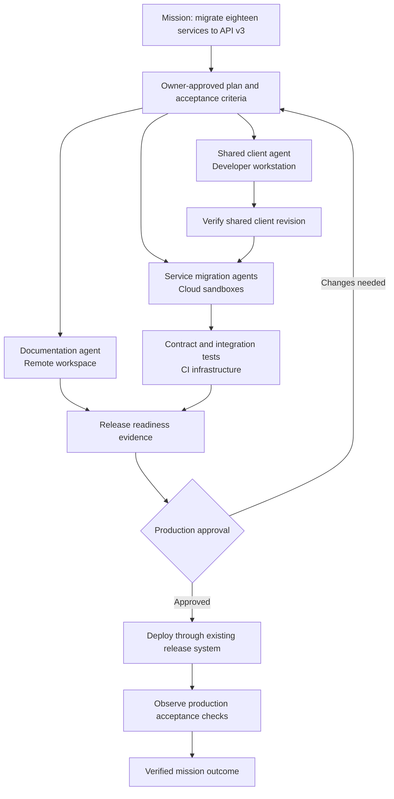
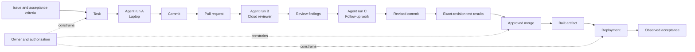
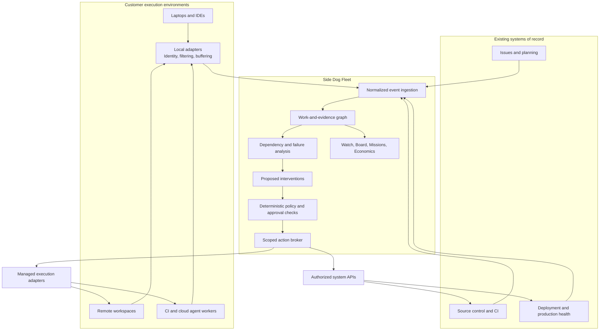

# Side Dog Fleet

## The operating layer for an agent-powered organization

**Build a commercial platform that turns a collection of independent agents
into an accountable, coordinated fleet.**

Side Dog today answers: **“What are my agents doing?”**

The commercial product should answer:

> **“What is our agent fleet accomplishing, what is preventing it from
> finishing, and what can we safely delegate next?”**

That is a substantially bigger business than terminal monitoring. It sits
between the systems where work is requested, the agents doing it, and the
systems that prove the work succeeded.

*Side Dog Fleet is a working name. This is a strategic proposal, dated
September 8, 2026, not a committed roadmap. Capabilities beyond today's local
Side Dog are proposed. Pricing, customer profiles, targets, and economic
examples below are hypotheses, not traction or forecasts.*

## 1. The opportunity hiding inside Side Dog

Side Dog already has several useful foundations:

- It recognizes activity across ten coding-agent integrations, with different
  setup requirements.
- It connects sessions to repositories, worktrees, models, tests, commits,
  issues, and PRs.
- It distinguishes agent contributions from passive GitHub observations.
- It presents time-oriented activity and current-state views.
- It preserves uncertainty rather than inventing attribution.
- It collects constrained metadata rather than uploading everyone's
  conversations.

The last two are particularly important.

The commercial opportunity is not simply to send those events to a server. It
is to build a **shared model of work across an organization**.

Today, an engineering leader can buy more agent capacity. But answering these
questions remains difficult:

> Which agents are working toward the same outcome? Which are duplicating
> work? Which are blocked by infrastructure rather than reasoning? Which
> changes have passed review but never reached production? Which model-and-tool
> configuration delivers acceptable results economically? Who authorized an
> agent's access, and is that authority still valid?

Side Dog's own delivery workflow illustrates the distinction:

**A fix implemented, a PR merged, a package published, and an installed tool
updated are four different facts.**

A fleet product should understand those distinctions automatically.

**The thesis: as agent execution becomes easier to acquire, coordination,
verification, and controlled delegation become the scarce resources.**

## 2. The product: manage outcomes, not terminal sessions

The primary object should be a **mission**: a bounded outcome with an owner,
constraints, acceptance criteria, and evidence.

Examples:

- Upgrade a deprecated API across eighteen services.
- Resolve a production incident and verify recovery.
- Deliver a feature across backend, frontend, SDK, documentation, and deployment.
- Patch a vulnerable dependency across an organization.
- Investigate failing release pipelines and restore delivery.

Each mission can involve multiple humans, agents, models, machines,
repositories, and tools.

| Field | Example |
| --- | --- |
| Outcome | Migrate all supported clients to API v3 |
| Owner | Payments platform team |
| Scope | Named services, repositories, and environments |
| Acceptance | Contract tests pass; deployment completes; error-rate checks pass |
| Budget | Model and execution spending limits |
| Authority | Open PRs and run tests; production rollout needs approval |
| Deadline | Agreed delivery window |
| Evidence | Commits, test results, approvals, deployments, observed health |

The buyer is not paying to watch more activity. They are paying to **complete
more accepted work with less supervision and fewer coordination failures**.

### One underlying model, several views

The principle that Watch and Board should present similar information in
different ways should become a core product rule.

- **Watch:** What happened, in what order?
- **Fleet Board:** What is running, blocked, stale, or awaiting intervention?
- **Mission view:** How does that activity contribute to an outcome?
- **Evidence view:** What proves completion, and what remains unverified?
- **Economics view:** What did accepted work cost?

These are projections of the same underlying records—not separate dashboards
with incompatible definitions.

## 3. What using it would feel like

Imagine an engineering team migrating eighteen services to a new API.

The agents are scattered across developer laptops, remote development
environments, CI workers, and cloud sandboxes. Some use Codex, some Claude
Code, some other harnesses.

A lead opens Side Dog Fleet and sees:

> **API v3 migration — delivery at risk**
>
> Three services are waiting on the same contract change. Two agents are
> independently modifying the shared client. Four verification runs are
> blocked by a failed runner image. Production rollout is waiting for the
> designated owner.

The important capability is that **four failing agent tasks become one
infrastructure incident**, rather than four apparently ineffective agents.

The lead asks:

> “What should I do to get this migration finished?”

Fleet returns an evidence-backed proposal:

1. Establish one owner for the shared client change.
2. Hold dependent tasks until its compatibility tests pass.
3. Repair the runner pool instead of rerunning the same failing tests.
4. Resume dependent tasks against the verified client revision.
5. Request production approval only after all required checks pass.

Each recommendation links to the observations supporting it. Uncertain
relationships are labeled.

The lead approves the plan. For agents under managed control, Fleet performs
the authorized coordination. For agents it can only observe, it requests
intervention from their owners.

**That is the investor demo:** heterogeneous agents, a cross-system problem,
a useful intervention, and a verified outcome. Not a screen full of blinking
activity indicators.

## 4. The central technical asset: a work-and-evidence graph

The most valuable asset would be a graph connecting:

**Intent → delegation → execution → artifacts → verification → outcome**

An ordinary trace explains a run. This graph explains how work survives
across runs, tools, and organizational boundaries.

### Understanding requires more than correlation

The graph should distinguish:

- **Observed:** GitHub reports a PR was merged.
- **Declared:** An agent says it worked on a task.
- **Verified linkage:** An authenticated run produced a specific commit.
- **Inferred:** A task and session appear related.
- **Unknown:** The available evidence is insufficient.

A matching branch name should not become proof of authorship. An agent
saying “done” should not become proof of deployment.

Every important conclusion needs its source, timestamp, scope, and freshness.

### Completion is a set of evidence gates

Avoid a single overloaded “completed” status. A mission can be:

- implementation complete;
- tests passed on the relevant revision;
- review settled;
- merged;
- deployed;
- accepted by the system or person responsible.

Those are distinct milestones. A customer decides which ones constitute
success. This makes Fleet useful to engineering, operations, and finance
without pretending a single productivity score captures everything.

### Deeper understanding without pretending to read minds

Fleet should understand declared objectives and plans, dependencies between
work items, changes to artifacts, permissions and resource constraints,
recurring failure patterns, and externally verified results.

It does **not** need access to an agent's private reasoning to do this.

Start with deterministic joins and explicit task contracts. Use models to
summarize evidence and propose explanations. Do not let a model's explanation
silently become authoritative state.

## 5. Multi-system architecture: observe broadly, control selectively

The platform must work across three kinds of boundary:

1. **Execution:** laptops, servers, containers, CI, remote workspaces, hosted
   agent services.
2. **Tools:** coding harnesses, model providers, issue trackers, source control,
   deployment systems, observability platforms.
3. **Organization:** teams, cloud accounts, environments, subsidiaries, external
   collaborators.

Separate the architecture into an observation path and an action path.

### Edge adapters

Evolve Side Dog's collectors into lightweight local adapters. They should
retain useful local operation without cloud connectivity, normalize
provider-specific events, filter data before export, buffer safely during
network interruptions, report adapter health and coverage gaps, and use
authenticated device and workload identities.

Prefer stable APIs, hooks, and structured events where available. Local file
readers remain a compatibility mechanism, not the entire enterprise
integration strategy.

### A durable event and state layer

Multi-machine operation introduces duplicate delivery, out-of-order events,
clock skew, disconnected machines, expired sessions, conflicting state
reports, and differing permissions on related objects.

Use stable event IDs, source sequence information, replayable projections,
and explicit reconciliation. For external actions, design for idempotency
and readback. Do not promise exactly-once execution across arbitrary
third-party APIs.

### Three levels of integration

This distinction should be visible throughout the product.

| Mode | What Fleet can legitimately promise |
| --- | --- |
| Observe | Discover activity, correlate evidence, alert owners |
| Cooperate | Request cancellation, receive checkpoints, exchange task context through supported interfaces |
| Manage | Launch isolated work, enforce budgets and scoped credentials, gate actions |

**An unmanaged laptop is not controllable merely because its activity is
visible.**

A “stop” button must report whether it requested cancellation, received
acknowledgment, or actually observed execution stop. Revoking access to
mediated tools is different from terminating a process.

### Policy enforced outside the agent

Examples:

- This mission may open PRs but may not merge them.
- This agent can read one repository and write only to its assigned branch.
- Production credentials require a separate approval.
- A retry budget applies across all child runs, not independently to each one.
- A model change requires an approved configuration.
- Network access is restricted by the managed execution environment.

The enforcement belongs in credentials, runtimes, gateways, and tool
authorization—not in a prompt asking the agent to behave.

### Context handoffs, not magical session migration

A useful handoff package contains the task objective, acceptance criteria,
current artifact revisions, verified progress, outstanding questions,
relevant evidence links, and permitted next actions.

That allows another compatible agent to continue the work. It does not imply
that arbitrary internal state can be transferred between different vendors'
agents.

## 6. The commercial features customers would pay for

### Fleet intelligence

A current inventory of agents, owners, missions, models, environments, and
permissions. Crucially, it includes coverage:

> “We can observe these runs. These machines are offline. These hosted
> sessions expose only partial telemetry.”

Missing telemetry must not look like healthy inactivity.

### Coordination and intervention

Detect and help resolve overlapping edits to shared artifacts, duplicated
tasks, blocked dependency chains, repeated failures with the same underlying
cause, retry loops, review ping-pong, abandoned work, and model spending
without accepted progress.

Start with recommendations. Automate only well-bounded interventions
supported by evidence and customer policy.

### A human decision inbox

Bring approval and escalation requests together. Each request should show
what decision is needed, why it is needed now, affected systems and scope,
supporting evidence, consequences of approval, recovery options, expiration,
and authorized approvers.

This should reduce interruptions, not create a new stream of notifications.

### Outcome economics

Measure the cost of **accepted work**, not just tokens. Include model usage,
execution and CI cost, retries and discarded work, human review and
intervention time where reliably measured, and rework after acceptance.

Separate measured amounts from estimates and unallocated spending.

Model comparisons should be specific:

> “For this class of dependency update, this configuration has a lower
> accepted-task cost at comparable quality.”

Not:

> “Model A is 37% better than Model B.”

Task difficulty, selection effects, and differing acceptance standards make
universal rankings misleading.

### Institutional memory

Over time, Fleet learns operational facts: which test failures are usually
infrastructure problems, which modules need specialized review, which agent
configurations work for a task class, which approvals reliably delay a
release, and which handoffs tend to fail.

Store those as versioned, evidence-linked operational knowledge, with owners
and expiration—not an unmaintained pile of generated summaries.

## 7. Privacy could be a differentiator—but not a vague promise

Side Dog's current privacy posture is a valuable starting point. Preserve it.

Offer three explicit data modes:

- **Metadata mode:** activity types, identifiers, timing, state, and permitted
  artifact references. No prompt or source upload.
- **Customer-local intelligence:** richer analysis runs inside the customer
  environment; only approved conclusions and evidence references leave it.
- **Opt-in content analysis:** customers explicitly authorize selected source,
  plans, diffs, or documents for deeper analysis, with retention and access
  controls.

Do not quietly convert a privacy-conscious local tool into employee
surveillance software.

Product commitments should include:

- no individual developer leaderboard based on token or activity counts;
- source-system permissions preserved during retrieval;
- explicit limits on cross-repository aggregation;
- tenant isolation and auditable administrative access;
- no cross-customer training on private work by default;
- retention and deletion policies appropriate to both operational data and
  audit records.

Side Dog's disposable local history should not suddenly be advertised as
compliance-grade evidence. Enterprise auditability requires new durability,
integrity, identity, and retention mechanisms.

## 8. Where this sits competitively

This is not an empty market, and an investor will know that. The following
positioning reflects official product descriptions checked September 8, 2026;
competitor capabilities will change.

| Existing category | What is already offered | Proposed Side Dog position |
| --- | --- | --- |
| Agent observability | Tracing, evaluation, cost and production correlation | Work that spans independent coding runs, repositories, delivery systems, and humans |
| Agent platforms | Deployment, identity, permissions, approvals | Coordinate an existing heterogeneous fleet without requiring wholesale migration |
| Governed development environments | Isolation, model access, network policy, auditing | Connect execution controls to mission dependencies and verified delivery |
| Code/session memory | Link agent sessions and context to code changes | Extend lineage through verification, deployment, acceptance, and intervention |

Datadog already offers agent tracing, evaluations, infrastructure correlation,
and cost/quality visibility. LangSmith Fleet already documents permissions,
credentials, auditing, and centralized approvals. Coder markets governed
coding-agent environments. Entire links sessions and conversations to
commits. These are substantial overlaps, not peripheral competitors.
[Datadog](https://www.datadoghq.com/products/ai/agent-observability/),
[LangSmith](https://docs.langchain.com/langsmith/fleet/access-and-oversight),
[Coder](https://coder.com/solutions/ai-governance),
[Entire](https://entire.io/).

**“We support multiple models” and “we have an agent dashboard” are not
defensible positioning.**

The positioning worth testing is:

> **Side Dog closes the coordination gap between independently operated
> agents and the systems that certify their work.**

Even that advantage must be earned. Incumbents can expand.

### What could become defensible

1. **Reliable cross-system identity and lineage.** Correctly reconstructing
   work through retries, model switches, handoffs, and artifact revisions is hard.
2. **Customer-specific outcome history.** Evidence about accepted work can
   improve routing and intervention within each organization.
3. **Embedded operational workflows.** Approvals, ownership, mission contracts,
   and delivery checks become part of how teams operate.
4. **Developer distribution.** The local tool provides a low-friction entry
   point and a place to earn trust.
5. **An extensible integration ecosystem.** Useful—but connectors alone are
   maintenance work, not a moat.

There is no automatic cross-customer data advantage. Private operational
data cannot be assumed available for pooled learning.

## 9. Who buys first, and why

Start with **software organizations of roughly 50–500 engineers already
using multiple agent tools**. That is an initial customer hypothesis, not a
market-size claim.

The strongest early accounts have a platform engineering or
developer-productivity owner, meaningful agent adoption already underway,
work split between laptops and remote execution, recognizable coordination
problems, and enough delivery volume to measure improvement.

**Champion:** platform engineering or developer productivity lead.
**Economic buyer:** VP Engineering or CTO.
**Required partners:** security and engineering managers.
**Daily users:** developers supervising several tasks and team leads managing
delivery.

Do not begin with either individual hobbyists as the revenue engine or the
most heavily regulated global enterprises as the first implementation target.

### Land with visibility; expand with controlled execution

A practical sales sequence:

1. Install read-only adapters and connect source control.
2. Establish fleet coverage and a delivery baseline.
3. Identify recurring, evidence-backed coordination failures.
4. Run an intervention pilot.
5. Introduce managed execution for selected workflows.
6. Expand to more teams and higher-value missions.

The customer should receive value before agreeing to replace their
development environment.

### Business model

Keep local Side Dog useful and free. Sell the organization layer.

A pricing hypothesis to test:

- **Team:** shared fleet visibility, mission tracking, retained evidence;
  low-thousands of dollars monthly.
- **Organization:** coordination, policy, broader integrations, administration;
  annual contracts in the tens of thousands.
- **Enterprise:** private deployment, advanced governance, support and service
  commitments; larger negotiated contracts.

Prefer a platform subscription with included capacity and transparent usage
bands. Charging primarily per ephemeral agent encourages customers to hide
or consolidate the very activity the product should understand.

Pass through execution costs clearly if managed compute is offered. Do not
depend on opaque model markups.

### An illustrative value case

Suppose 100 engineers each recover one hour per week from reduced agent
babysitting. At 46 working weeks and a hypothetical loaded cost of $100/hour:

**100 × 1 × 46 × $100 = $460,000 of annual engineering capacity.**

That is not cash savings or guaranteed ROI. The customer must demonstrate
that recovered time produces useful output. But it gives a plausible basis
for testing a $60,000 annual contract—and a clear measurement obligation.

## 10. The roadmap that makes the big vision credible

| Stage | Build | Evidence required before expanding |
| --- | --- | --- |
| First 90 days | Shared fleet inventory, cross-machine identity, issue→run→PR linkage, blocker inbox | Design partners use it repeatedly and trust its attribution |
| Months 3–6 | Mission dependencies, coordinated approvals, budget visibility, selected interventions | Measurable reduction in supervision or blocked time |
| Months 6–12 | Managed workers, scoped action execution, outcome-cost analysis, handoff packages | Customers expand deployments and pay for coordination |
| Months 12–18 | Policy-constrained routing, richer operational memory, additional workflow domains | Reliable accepted outcomes with less human intervention |

The first product should **not** include every cloud, every SaaS system, a
universal agent builder, its own source-control platform, or autonomous
production operations.

A disciplined initial slice could be two widely used coding-agent
integrations, laptop and Linux-worker coverage, GitHub, one issue tracker,
one CI/deployment path, and one mission type such as cross-repository
maintenance.

The architecture supports the larger vision; the first sale solves a
narrow, expensive problem.

### The measurements investors should care about

- Human intervention minutes per accepted mission.
- Time spent blocked versus executing.
- Accepted-task cost, including rework.
- Delivery throughput with quality held constant.
- Accuracy of the system's blocker and duplication alerts.
- Percentage of relevant fleet activity with verified attribution.
- Paid conversion and expansion from pilot teams.
- Whether teams still need it after the novelty wears off.

Suggested pilot targets—explicitly hypotheses—could include a 25% reduction
in supervision time and high enough alert precision that leads act on the
inbox rather than mute it.

**The kill criterion:** if teams enjoy the dashboard but cannot identify
repeatable operational value, do not scale sales around it.

## 11. The bigger company this could become

The initial domain is software delivery because Side Dog already has access
to the right signals and because tests, commits, releases, and deployments
provide unusually concrete evidence.

The expansion is into **agent-executed operational work**:

- IT: access changes, provisioning, device remediation.
- Security: investigation, patch coordination, evidence collection.
- Data operations: pipeline repair, migration, quality remediation.
- Business operations: bounded workflows with explicit acceptance and authorization.

The same abstraction can apply:

**An owner delegates an outcome; agents act across systems; policy constrains
execution; independent evidence establishes completion.**

But each domain needs its own acceptance rules and integrations. A merged PR
is not a resolved incident, and a completed tool call is not a correct
financial transaction.

The long-term company is therefore not “a better agent.” It is the **system
of record and controlled execution layer for work performed by agents**.

At a hypothetical $100,000 average annual contract, 1,000 organizations would
represent $100 million in annual recurring revenue. That is a scale scenario,
not a researched TAM or forecast. The real investment question is whether a
repeatable beachhead exists that can expand toward that level of
organizational importance.

## The investor pitch

> Companies are deploying agents faster than they can coordinate and verify
> their work. The result is fragmented execution: tasks span laptops,
> clouds, models, repositories, and business systems, while humans remain
> responsible for stitching everything together.
>
> Side Dog starts where that fragmentation is visible—with a developer's
> local agent fleet—and grows into the organization's operating layer for
> agent work.
>
> We connect intent to execution and execution to verified outcomes. Teams
> can see what is blocking delivery, coordinate heterogeneous agents, enforce
> delegated authority, and measure the real cost of accepted work.
>
> We do not need to win the model race or replace every agent platform. We
> need to become the trusted place organizations go to answer: **What did our
> agents accomplish, and what should happen next?**

Build toward that ambition, but make the first commercial promise concrete:

> **Run more agent work without proportionally increasing the humans needed
> to supervise it.**
