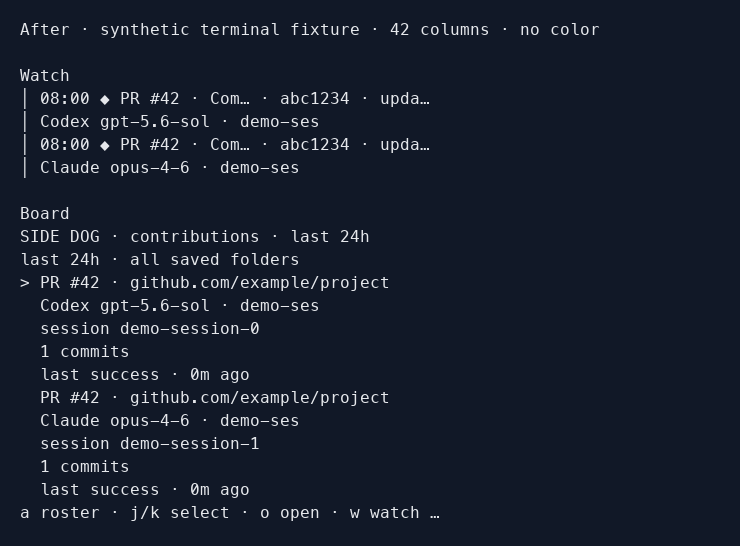

# Documentation validation

Publication metadata checked September 8, 2026: PyPI hosts the 2.0.0 wheel and
source distribution. The old public package README still includes pre-publication
wording; this source documentation corrects it for the next package build.

Validation for issues #193 and #196 includes CLI help and manual generation,
unit regressions for attribution/accounting/history, package contents, and
canonical and rendered documentation links. Terminal fixtures are synthetic;
no private user activity is included in documentation evidence.

Linux package-manager commands, shell PATH behavior, desktop notifications and
interactive terminal rendering still need hands-on Linux validation under #194.
CI's Ubuntu/macOS Python matrix is automated runtime coverage, not evidence that
every desktop workflow was manually exercised.

## Terminal evidence

These images render actual terminal output from deterministic, synthetic events.
They are not captures of a user's private sessions. The baseline is main commit
`a6ebc10`; two completed contributors to the same PR have no live roster entry.
The new Board history view retains both, and Watch shows the event-time models.

| Width | Before | After |
| --- | --- | --- |
| 100 columns | [Before](evidence/before-100.png) | [After](evidence/after-100.png) |
| 42 columns | [Before](evidence/before-42.png) | [After](evidence/after-42.png) |
| 28 columns | [Before](evidence/before-28.png) | [After](evidence/after-28.png) |

## Local results

On macOS, the full 1,318-test suite passed on Python 3.13 with one platform
skip. A real terminal pseudo-TTY tour and browser demo displayed synthetic
activity with usage disabled. The wheel and source distribution built and
passed Twine metadata checks; the wheel's executable, doctor, activity view and
bundled man-page lookup passed isolated installation smoke checks.
Release-version validation passed, and manuals matched CLI metadata and passed
`mandoc` lint. Canonical links and Pages staging passed locally; the PR's
Documentation job also built Jekyll and validated rendered links.
